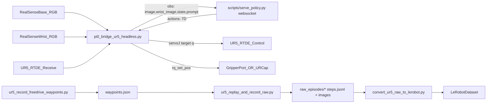

# UR5 + OpenPI (π₀ / π₀.5) Setup & Testing — Research Report

Date range inferred from artifacts: **2026-01-13** (scripts/docs reference this date in examples and defaults).

## Summary (what changed vs “original”)

Comparison baseline: `/home/ims/openpi_original`  
Current tree: `/home/ims/openpi`  
Diff scope: **medium depth**, excluding generated outputs (e.g., `raw_episodes/`, `.venv/`, images).

**Counts**
- **Added files**: 21
- **Modified files**: 5
- **Removed files**: 0

High-level intent of the changes: **add an end-to-end UR5 real-robot runtime path** for OpenPI, including:
- UR5-specific **policy I/O transforms** (so π-models can consume UR5 observations and emit UR5 actions),
- UR5 **runtime bridges** (RealSense → websocket policy server → RTDE servo control),
- UR5 **data collection pipeline** (freedrive waypoints → replay+record raw episodes → convert to LeRobot),
- UR5 **Docker “all-in-one” launch path** for running policy server + bridge together,
- UR5 **hardware verification scripts** (RealSense discovery, RTDE state readout, safe movement+gripper test).

## Executive technical summary (system-level)

The UR5 integration introduces **three distinct but interoperable layers**:

1) **Model interface layer** (new UR5 transforms)
- Establishes a deterministic mapping from *robot-runtime observations* to *model inputs* and from *model outputs* to *robot-runtime actions*.
- Key deliverable: `src/openpi/policies/ur5_policy.py` + associated tests.

2) **Runtime control layer** (robot bridge)
- A tight loop that:
  - samples sensors (RealSense, RTDE receive),
  - calls the model via websocket,
  - executes a constrained control primitive (`servoJ`) for a bounded duration per action chunk.
- Key deliverable: `local/utils/pi0_bridge_ur5_headless.py`

3) **Research data layer** (repeatable acquisition + conversion)
- A repeatable method to:
  - collect sparse human-guided trajectories (freedrive),
  - replay them deterministically on the robot (URScript moveJ program),
  - record synchronized vision + proprio + action deltas,
  - convert the result into LeRobot format for finetuning.
- Key deliverables: `local/scripts/ur5_*` + `examples/ur5/convert_ur5_raw_to_lerobot.py`

## Change inventory (file-level)

### Modified files (5)
- `scripts/serve_policy.py`
  - Added `EnvMode.UR5` and a default checkpoint mapping: `UR5 → (config=pi05_ur5, dir=gs://openpi-assets/checkpoints/pi05_base)`.
- `src/openpi/training/config.py`
  - Added import `openpi.policies.ur5_policy`.
  - Added training config `pi05_ur5` with `Pi0Config(action_horizon=15, pi05=True)` and UR5 transforms.
  - Set `policy_metadata` with a `reset_pose` used by UR5 runtime.
- `pyproject.toml`
  - Added runtime deps for real hardware: **`ur-rtde`** and **`pyrealsense2`**.
- `examples/ur5/README.md`
  - Expanded with concrete UR5 dataset collection steps using the new local scripts.
- `uv.lock`
  - Large lockfile update reflecting dependency changes (including the additions above).

### Added files (21) — grouped by purpose

**UR5 runtime (policy inference on robot)**
- `local/utils/pi0_bridge_ur5_headless.py` — headless bridge that:
  - reads RealSense RGB (base + wrist),
  - reads UR joint state via RTDE receive,
  - calls websocket policy server (`openpi_client.websocket_client_policy`),
  - applies actions via RTDE control (`servoJ` path), with step clamps and timing.
- `examples/ur5/{main.py, env.py, real_env.py, convert_ur5_raw_to_lerobot.py}` — example runtime + dataset conversion utilities.

**UR5 data collection (research data acquisition)**
- `local/scripts/ur5_record_freedrive_waypoints.py` — record sparse joint-space waypoints in freedrive/teach.
- `local/scripts/ur5_replay_and_record_raw.py` — replay waypoints (URScript `movej` program) while recording images + proprio + actions.
- `local/scripts/README.md` — operational notes and defaults for the above.

**Hardware setup / verification**
- `local/test/{README.md, rs_list.py, camera_test.py, ur_read_state.py, ur_test_movement.py}` — camera discovery & preview + RTDE state read + movement/gripper tests.
- `local/Robotiq/{Gripper.script, setzero.script, socket UR send file.py}` — Robotiq URCap-related artifacts for gripper control via socket service.

**Containerization / launch workflow**
- `local/docker/serve_policy_robot.Dockerfile` — GPU Docker image that runs policy server + robot bridge.
- `launch_guide.md` — step-by-step launch/run instructions with example parameters.
- `local/scripts/download_checkpoints.py` — build-time checkpoint download helper for the Docker image.

**Policy transforms**
- `src/openpi/policies/ur5_policy.py` — UR5-specific input/output transforms.
- `src/openpi/policies/ur5_policy_test.py` — tests for `UR5Inputs`/`UR5Outputs`.

## Key technical changes (why they matter)

### 1) “Serve policy” gained a UR5 environment mode
File: `scripts/serve_policy.py`

The websocket policy server entrypoint now supports `--env=UR5` and selects:
- **Config**: `pi05_ur5`
- **Checkpoint dir**: `gs://openpi-assets/checkpoints/pi05_base`

This is a critical integration point: it makes “UR5 runtime assumptions” an explicit *server mode* rather than an ad-hoc client convention.

**Code example (default mapping)**:

```python
DEFAULT_CHECKPOINT: dict[EnvMode, Checkpoint] = {
    # ...
    EnvMode.UR5: Checkpoint(
        config="pi05_ur5",
        dir="gs://openpi-assets/checkpoints/pi05_base",
    ),
}
```

### 2) Added an inference config `pi05_ur5` that wires UR5 transforms + metadata
File: `src/openpi/training/config.py`

The new config:
- selects π₀.5 model settings suitable for UR5 runtime (`pi05=True`, `action_horizon=15`),
- sets UR5 normalization stats selection via `AssetsConfig(asset_id="ur5e")`,
- installs UR5 transforms (`UR5Inputs`/`UR5Outputs`),
- publishes a **`reset_pose`** through `policy_metadata` so clients can move the robot to a known start configuration.

**Code example (config wiring)**:

```python
TrainConfig(
    name="pi05_ur5",
    model=pi0_config.Pi0Config(action_horizon=15, pi05=True),
    data=SimpleDataConfig(
        assets=AssetsConfig(asset_id="ur5e"),
        data_transforms=lambda model: _transforms.Group(
            inputs=[ur5_policy.UR5Inputs(model_type=ModelType.PI05)],
            outputs=[ur5_policy.UR5Outputs()],
        ),
        base_config=DataConfig(prompt_from_task=True),
    ),
    policy_metadata={"reset_pose": [-1.5708, -0.7854, -2.0944, -1.3089, 1.5708, 0.0]},
)
```

### 3) Added explicit hardware dependencies (UR RTDE + RealSense)
File: `pyproject.toml`

Two runtime deps were added:
- `ur-rtde`: provides `rtde_receive` and `rtde_control` used throughout `local/test/*`, `local/scripts/*`, and the runtime bridge.
- `pyrealsense2`: provides RealSense capture in tests, data recording, and runtime bridge(s).

This aligns the Python dependency graph with the new hardware-facing code (instead of relying on ad-hoc pip installs).

### 4) New UR5 “policy I/O contract” via `UR5Inputs`/`UR5Outputs`
File: `src/openpi/policies/ur5_policy.py`

UR5 support hinges on agreeing on a *data contract* between:
- the runtime bridge and datasets (what keys exist, shapes/dtypes), and
- the model (what image slots and state/action vectors it expects).

`UR5Inputs` explicitly supports **two source formats**:
- training-ish keys: `joints`, `gripper`, `base_rgb`, `wrist_rgb`
- inference keys: `observation/state`, `observation/image`, `observation/wrist_image`, plus `prompt`

It then maps into model-standard:
- `inputs["state"]`: \(7\) dims \(= q(6) + gripper(1)\)
- `inputs["image"]`: named slots, e.g. (for PI0/PI05) `base_0_rgb`, `left_wrist_0_rgb`, `right_wrist_0_rgb` (filled with zeros)
- `inputs["image_mask"]`: indicates which image slots are “real”

**Code example (inference path + slot mapping)**:

```python
state = np.asarray(data["observation/state"], dtype=np.float32).reshape(-1)
if state.shape[0] != 7:
    raise ValueError(f"Expected observation/state shape (7,), got {state.shape}.")

inputs = {
    "state": state,
    "image": {
        "base_0_rgb": base_image,
        "left_wrist_0_rgb": wrist_image,
        "right_wrist_0_rgb": np.zeros_like(base_image),
    },
    "image_mask": {
        "base_0_rgb": np.True_,
        "left_wrist_0_rgb": np.True_,
        "right_wrist_0_rgb": np.False_,  # for PI0/PI05
    },
}
```

`UR5Outputs` is intentionally simple: it slices the model output to the UR5 action dimensionality:
- \(7\) dims \(= \Delta q(6) + gripper(1)\)

### 5) New “UR5 bridge” that closes the real robot control loop
File: `local/utils/pi0_bridge_ur5_headless.py`

This script is a minimal robot runtime that:
- captures RealSense RGB (base + optional wrist),
- reads joints via `RTDEReceiveInterface`,
- sends observations to the websocket policy server,
- takes returned actions and applies them via `RTDEControlInterface.servoJ`.

#### Data contract: what the policy server receives
The bridge forms the observation like:

```python
q = np.asarray(rcv.getActualQ(), dtype=np.float32)
state = np.concatenate([q, np.array([0.0], dtype=np.float32)], axis=0)  # (7,)

obs = {
    "observation/image": rgb_base,          # uint8 (224,224,3)
    "observation/wrist_image": rgb_wrist,   # uint8 (224,224,3)
    "observation/state": state,             # float32 (7,)
    "prompt": PROMPT,                       # str
}
out = client.infer(obs)
```

#### Action semantics and safety clamp
The bridge interprets action vectors as:
- first 6 dims: either **delta joints** (default) or **absolute joints** (`ACTION_MODE=absolute`)
- last dim: gripper command (normalized 0..1; clipped inside `_set_gripper`)

Safety clamp is applied in delta mode per-step, per joint:

```python
max_step_rad = np.deg2rad(MAX_STEP_DEG)
dq = np.asarray(a[:6], dtype=np.float32)
q_tgt = q + np.clip(dq, -max_step_rad, max_step_rad)
```

Then motion is executed with `servoJ`, repeatedly for `HOLD_PER_STEP` seconds:

```python
while time.time() - t0 < HOLD_PER_STEP:
    ctrl.servoJ(q_tgt.tolist(), VEL, ACC, DT, LOOKAHEAD, GAIN)
    time.sleep(DT)
```

This creates a tunable “outer loop” (policy inference cadence) and “inner loop” (servo tracking), controlled entirely by env vars (see the Appendix).

#### Runtime parameterization (environment variables)
The bridge is designed as a research instrument: **all key dynamics can be tuned without code changes**.

From `local/utils/pi0_bridge_ur5_headless.py` (defaults shown):
- **Robot endpoint**: `UR_IP=192.10.0.11`
- **Policy endpoint**: `POLICY_HOST=localhost`, `POLICY_PORT=8000`
- **Cameras**: `RS_BASE`, `RS_WRIST`, `RS_W=640`, `RS_H=480`, `RS_FPS=60`, `RS_TIMEOUT_MS=10000`
- **Control primitive**:
  - `DT=0.05` (servo step)
  - `VEL=0.05`, `ACC=0.05` (servo parameters)
  - `LOOKAHEAD=0.2`, `GAIN=150` (UR servo tuning)
- **Chunking**:
  - `HORIZON_STEPS=10` (how many action vectors to apply per policy call)
  - `HOLD_PER_STEP=0.15` seconds (how long to servo toward each step target)
- **Safety**: `MAX_STEP_DEG=2.0` (per-joint clamp applied to delta actions)
- **Mode switches**:
  - `ACTION_MODE=delta|absolute`
  - `DRY_RUN=0|1`
  - `FAKE_CAM=0|1`
  - `SHOW_IMAGES=0|1`

#### Concrete launch parameter sets (from `launch_guide.md`)
The launch guide documents multiple tested parameter regimes (examples):
- **More conservative / smoother servo**:
  - `MAX_STEP_DEG=0.10`, `DT=0.05`, `VEL=0.05`, `ACC=0.10`, `LOOKAHEAD=0.10`, `GAIN=200`
- **Higher-rate inner loop**:
  - `MAX_STEP_DEG=0.5`, `DT=0.01`, `VEL=0.08`, `ACC=0.15`, `LOOKAHEAD=0.12`, `GAIN=300`
- **Headless / minimal horizon**:
  - `SHOW_IMAGES=0`, `HORIZON_STEPS=1`, `INFER_PERIOD=0.15`

This is a key research characteristic: it suggests iterative tuning of stability vs responsiveness vs safety.

### 6) New data collection pipeline for UR5 (freedrive → replay → raw episodes)
Files:
- `local/scripts/ur5_record_freedrive_waypoints.py`
- `local/scripts/ur5_replay_and_record_raw.py`
- `local/scripts/README.md`

The data pipeline is designed for reproducible “research recording”:

1) **Waypoints recording** (human-guided freedrive):
- Collects sparse joint configurations in a raw JSON format.
- Includes robust teardown logic for RTDE control sessions to avoid lingering control scripts.

2) **Replay + record**:
- Sends a URScript program (`movej(...)`) over port `30002` to replay waypoints.
- Records at fixed FPS (default 10 Hz):
  - RGB images resized/padded to **256×256** and stored as JPEGs
  - RTDE joint state (q, qd)
  - derived action: \(\Delta q_t = q_t - q_{t-1}\)
  - gripper command (optionally from waypoints)
- Embeds explicit “spec” in episode metadata:

```json
{
  "state_spec": {"dtype": "float32", "shape": [7], "desc": "actual_q(6) + gripper_cmd(1)"},
  "action_spec": {"dtype": "float32", "shape": [7], "desc": "delta_q(6) + absolute gripper_cmd(1)"}
}
```

#### URScript generation (waypoint replay)
Replay builds a small URScript program with optional blending and pauses around gripper changes:

```python
lines.append(f"  movej({q}, a={acc}, v={vel}, r={r_i})")
if abs(next_g - current_g) > 0.1:
    lines.append(f"  sleep({gripper_stop_delay_sec})")
    lines.append(f"  sleep({gripper_pause_sec})")
```

This is a pragmatic research choice: you can tune speed/acc/blending without reimplementing low-level interpolation.

#### Data schema detail: `steps.jsonl`
Each JSONL line is a single timestep record including (observed in implementation):
- `q_actual`: \(6\) joint angles (rad)
- `qd_actual`: \(6\) joint velocities (rad/s)
- `gripper_cmd`: scalar command (0..1)
- `state`: list length 7 (float32 on write)
- `actions`: list length 7 (float32 on write)
- `image_path` / `wrist_image_path`: relative paths to JPEGs
- `task`: prompt string

Representative code fragment (record loop):

```python
state = np.asarray([*q.tolist(), g_cmd], dtype=np.float32)  # (7,)
delta_q = np.zeros((6,), dtype=np.float32) if prev_q is None else (q - prev_q).astype(np.float32)
actions = np.asarray([*delta_q.tolist(), g_cmd], dtype=np.float32)  # (7,)

step = {
    "q_actual": q.tolist(),
    "qd_actual": qd.tolist(),
    "gripper_cmd": float(g_cmd),
    "state": state.tolist(),
    "actions": actions.tolist(),
    "image_path": str(base_rel),
    "wrist_image_path": str(wrist_rel),
    "task": prompt,
}
```

This choice (recording \(\Delta q\) as the “action”) aligns with delta-action policy conventions and makes the dataset compatible with runtime control that uses incremental targets.

#### RTDE robustness / operational mitigations
The replay+record script contains explicit handling for common RTDE failure modes:
- RTDE receive is created with retries and validated by a `getActualQ()` call.
- RTDE receive is re-created if it becomes unhealthy (`ensure_rcv`).
- RTDE control creation emits a **specific actionable error** if the robot reports
  “RTDE input registers are already in use”, advising disabling Fieldbus adapters (EtherNet/IP, PROFINET, MODBUS) and rebooting.

Code excerpt (error specialization):

```python
if "RTDE input registers are already in use" in msg:
    raise RuntimeError(
        "RTDE control cannot start because RTDE input registers are in use.\n"
        "On the teach pendant disable Fieldbus adapters that reserve registers:\n"
        "- Installation -> Fieldbus -> EtherNet/IP (disable)\n"
        "- Installation -> Fieldbus -> PROFINET (disable)\n"
        "- Installation -> Fieldbus -> MODBUS (disable any units)\n"
        "Then fully reboot the robot controller and retry.\n"
        "Also ensure no other RTDE client is connected."
    ) from e
```

This is “research quality-of-life” work: it reduces time lost to ambiguous connection failures during repeated experiments.

### 7) Docker “all-in-one” runtime
Files:
- `local/docker/serve_policy_robot.Dockerfile`
- `launch_guide.md`

The Dockerfile bakes a full runtime environment:
- CUDA base image (GPU inference)
- OpenPI deps via `uv`
- `pyrealsense2` + `ur-rtde` + system OpenCV GUI libs (for optional image preview)
- build-time checkpoint download to avoid runtime fetch stalls

It then starts:
1) policy server (`uv run scripts/serve_policy.py ...`) and
2) the UR5 bridge (`python /app/local/utils/pi0_bridge_ur5_headless.py`)

#### Device access & display plumbing (documented)
From `launch_guide.md`, the run command passes:
- `--device=/dev/bus/usb:/dev/bus/usb` for RealSense USB
- enumerated `/dev/video*` device passthrough for V4L2 devices
- optional X11 mounts + env for GUI preview:
  - mount `/tmp/.X11-unix`
  - `-e DISPLAY=$DISPLAY`
  - user-side `xhost +local:docker`

These details matter technically: if camera frames are not arriving or `imshow` crashes, this is the first layer to validate.

## System architecture (data flow)



## What was tested / executed (reconstructed research log)

This section is reconstructed from the repo’s scripts/docs and the defaults/parameters embedded in them.

### A) Environment & dependency setup
Two setup paths are documented:

- **Host venv path (for camera discovery + RTDE tests)**:
  - `launch_guide.md` uses `uv sync` + `uv pip install pyrealsense2 ur-rtde numpy opencv-python`.
  - `local/test/README.md` also calls out `uv pip install pyrealsense2 ur-rtde` for the hardware test scripts.

- **Docker path (for full policy+bridge runtime)**:
  - `local/docker/serve_policy_robot.Dockerfile` builds a CUDA image, installs OpenPI via `uv`, installs `pyrealsense2` + `ur-rtde`, then runs:
    - `uv run scripts/serve_policy.py ...` (policy server)
    - `python /app/local/utils/pi0_bridge_ur5_headless.py` (robot bridge)

### B) RealSense camera discovery / verification
- **Enumerate attached cameras**:
  - Script: `local/test/rs_list.py`
  - Purpose: print RealSense devices + serial numbers (used later as `RS_BASE` / `RS_WRIST`).

- **Live preview (optional)**:
  - Script: `local/test/camera_test.py` (documented in `local/test/README.md`)
  - Purpose: validate RGB stream acquisition and GUI preview before running control loops.

### C) UR5 RTDE connectivity & safety gating
- **Read-only robot state monitoring**:
  - Script: `local/test/ur_read_state.py`
  - Reads: joint positions/velocities, TCP pose, robot mode, safety mode, update rate.

- **Safe “nudge” movement + Robotiq gripper test**:
  - Script: `local/test/ur_test_movement.py`
  - Described test sequence:
    1. Robotiq activation via URCap socket service (port `63352`)
    2. Base joint movement: -20° then +20° (safe nudge)
    3. Robotiq gripper close and open
  - Built-in safety checks:
    - `ok_to_move()` requires `mode == 7` (RUNNING) and `safety == 1` (NORMAL) before motion.

### D) Dataset collection: freedrive waypoints → replay+record raw episodes
This flow is described in `local/scripts/README.md` and referenced from `examples/ur5/README.md`.

- **Record freedrive waypoints (no cameras required)**:
  - Script: `local/scripts/ur5_record_freedrive_waypoints.py`
  - Output (documented):
    - `raw_episodes/<episode_id>/waypoints.json`
    - `raw_episodes/<episode_id>/meta.json`

- **Replay waypoints and record a raw episode (images + proprio + actions)**:
  - Script: `local/scripts/ur5_replay_and_record_raw.py`
  - Output per episode:
    - `meta.json`, `waypoints.json`, `steps.jsonl`, `images/base/*.jpg`, `images/wrist/*.jpg`
  - Recording semantics in code:
    - images are processed to **256×256 RGB** (resize-with-pad),
    - `state` is recorded as 7D: `actual_q(6) + gripper_cmd(1)`,
    - `actions` is recorded as 7D: `delta_q(6) + absolute gripper_cmd(1)`.
  - Optional gripper path:
    - Robotiq control via URCap socket service, with retries/timeouts and waypoint-aware timing.

### E) Raw episodes → LeRobot conversion (for finetuning)
- Script: `examples/ur5/convert_ur5_raw_to_lerobot.py`
- Purpose:
  - reads `*/steps.jsonl` + `*/meta.json`,
  - loads recorded **256×256** JPEGs,
  - writes a LeRobot dataset with features:
    - `image`, `wrist_image`, `state(7)`, `actions(7)`, plus task text.

### F) Policy inference on UR5 (policy server + bridge)

#### F1) Docker “all-in-one” policy+bridge run
Documented in `launch_guide.md`:
- build: `docker build -t openpi_robot -f local/docker/serve_policy_robot.Dockerfile .`
- run: `docker run ... --network=host --device=/dev/bus/usb:/dev/bus/usb ... -e RS_BASE=... -e RS_WRIST=... -e PROMPT=... openpi_robot`

The guide includes multiple parameter sets; notable “research knobs” exercised include:
- **Inference cadence**: `INFER_PERIOD`, `HORIZON_STEPS`, `HOLD_PER_STEP`
- **Motion tuning**: `DT`, `VEL`, `ACC`, `LOOKAHEAD`, `GAIN`
- **Safety clamp**: `MAX_STEP_DEG`
- **Diagnostics**: `VERIFY_NORM_STATS=1`
- **Display**: `SHOW_IMAGES=0/1` and X11 forwarding (`xhost +local:docker`, mount `/tmp/.X11-unix`)

The Dockerfile default `SERVER_ARGS` explicitly selects UR5 mode:
- `ENV SERVER_ARGS="--env=UR5 policy:checkpoint --policy.config=pi05_ur5 --policy.dir=gs://openpi-assets/checkpoints/pi05_base"`

#### F2) Python runtime example (client runtime + UR5 environment)
Separately from the Docker bridge, `examples/ur5/main.py` shows a runtime that:
- connects to the websocket policy server,
- logs server metadata (including `reset_pose`),
- constructs a RTDE-based environment (`examples/ur5/real_env.py`) and runs episodes.

## Notes / issues observed in the artifacts (research caveats)
- **Two different gripper control surfaces exist**:
  - `local/scripts/ur5_*` and `local/test/ur_test_movement.py` implement Robotiq URCap socket protocol (port `63352`, GET/SET variables).
  - `local/utils/pi0_bridge_ur5_headless.py` (and `examples/ur5/real_env.py`) send `rq_set_pos(...)` to a configurable `GRIPPER_PORT`.
  - This likely reflects different gripper deployment configurations; a deployment should standardize on one.

- **Documentation mismatch**:
  - `examples/ur5/README.md` mentions `state` shape `(8,)` with a pad term, while the actual UR5 policy transform and raw recorder use **7D state** (6 joints + gripper command).
  - `local/test/README.md` uses `test_setup/...` paths, but the actual directory is `local/test/...`.

## Full file-by-file change log (medium-depth)

### Modified (5)
- **`scripts/serve_policy.py`**
  - Added `EnvMode.UR5`.
  - Added default checkpoint mapping for UR5 to `pi05_ur5` / `pi05_base`.
  - Effect: clients can select UR5 behavior by setting `--env=UR5` (including metadata).

- **`src/openpi/training/config.py`**
  - Imported `openpi.policies.ur5_policy`.
  - Added `TrainConfig(name="pi05_ur5", ...)` with UR5 transforms and `reset_pose`.
  - Effect: a single named config now defines UR5 inference expectations and key runtime metadata.

- **`pyproject.toml`**
  - Added `ur-rtde`, `pyrealsense2`.
  - Effect: UR5 runtime + tests can be installed from the main dependency set.

- **`examples/ur5/README.md`**
  - Expanded to document the “freedrive → replay+record” data acquisition path and the new local scripts.

- **`uv.lock`**
  - Updated lockfile content to match dependency additions and resolver revision.

### Added (21)

**Runtime and policy I/O**
- **`src/openpi/policies/ur5_policy.py`**: UR5 transform definitions (`UR5Inputs`, `UR5Outputs`).
- **`src/openpi/policies/ur5_policy_test.py`**: tests validating slot names and output slicing.
- **`local/utils/pi0_bridge_ur5_headless.py`**: RealSense+RTDE → websocket policy server → RTDE `servoJ` bridge.

**Data collection**
- **`local/scripts/ur5_record_freedrive_waypoints.py`**: freedrive waypoint capture, optional Robotiq socket protocol utility.
- **`local/scripts/ur5_replay_and_record_raw.py`**: URScript replay + fixed-FPS recording; robust RTDE connection helpers; optional Robotiq support.
- **`local/scripts/README.md`**: short operational overview and defaults.

**Hardware test utilities**
- **`local/test/rs_list.py`**: RealSense enumeration.
- **`local/test/camera_test.py`**: dual-camera preview with 224×224 preprocessing and exposure tweak.
- **`local/test/ur_read_state.py`**: RTDE receive state monitor.
- **`local/test/ur_test_movement.py`**: safe base joint nudge + Robotiq activation/open/close.
- **`local/test/README.md`**: describes the above test scripts.

**Docker / reproducible deployment**
- **`local/docker/serve_policy_robot.Dockerfile`**: GPU runtime image for “policy server + bridge”.
- **`launch_guide.md`**: step-by-step build/run instructions; multiple tuned parameter sets; X11 notes.
- **`local/scripts/download_checkpoints.py`**: build-time checkpoint caching via `fsspec`.

**UR5 example runtime + conversion**
- **`examples/ur5/main.py`**: runtime driving a UR5 environment using websocket policy server metadata.
- **`examples/ur5/env.py`**, **`examples/ur5/real_env.py`**: RTDE-based environment and RealSense hooks.
- **`examples/ur5/convert_ur5_raw_to_lerobot.py`**: raw episodes → LeRobot dataset conversion.

## Appendix: key defaults (UR5 bridge)
From `local/utils/pi0_bridge_ur5_headless.py`:
- **Robot**: `UR_IP=192.10.0.11`
- **Policy server**: `POLICY_HOST=localhost`, `POLICY_PORT=8000`
- **RealSense**: `RS_W=640`, `RS_H=480`, `RS_FPS=60`, `RS_TIMEOUT_MS=10000`
- **Control loop**: `DT=0.05`, `HOLD_PER_STEP=0.15`, `HORIZON_STEPS=10`
- **Motion tuning**: `VEL=0.05`, `ACC=0.05`, `LOOKAHEAD=0.2`, `GAIN=150`
- **Safety clamp**: `MAX_STEP_DEG=2.0`
- **Modes**: `ACTION_MODE=delta`, `DRY_RUN=0`
- **Display**: `SHOW_IMAGES=1` (if GUI is available and X11 is configured)

## Appendix: exact diff summary (for audit)
- Modified:
  - `examples/ur5/README.md` (expanded dataset collection instructions)
  - `pyproject.toml` (+ `ur-rtde`, `pyrealsense2`)
  - `scripts/serve_policy.py` (+ `UR5` env mode, default checkpoint)
  - `src/openpi/training/config.py` (+ `pi05_ur5` config, import `ur5_policy`, `reset_pose` metadata)
  - `uv.lock` (dependency lock update)
- Added (21): see “Added files (21)” section above.
